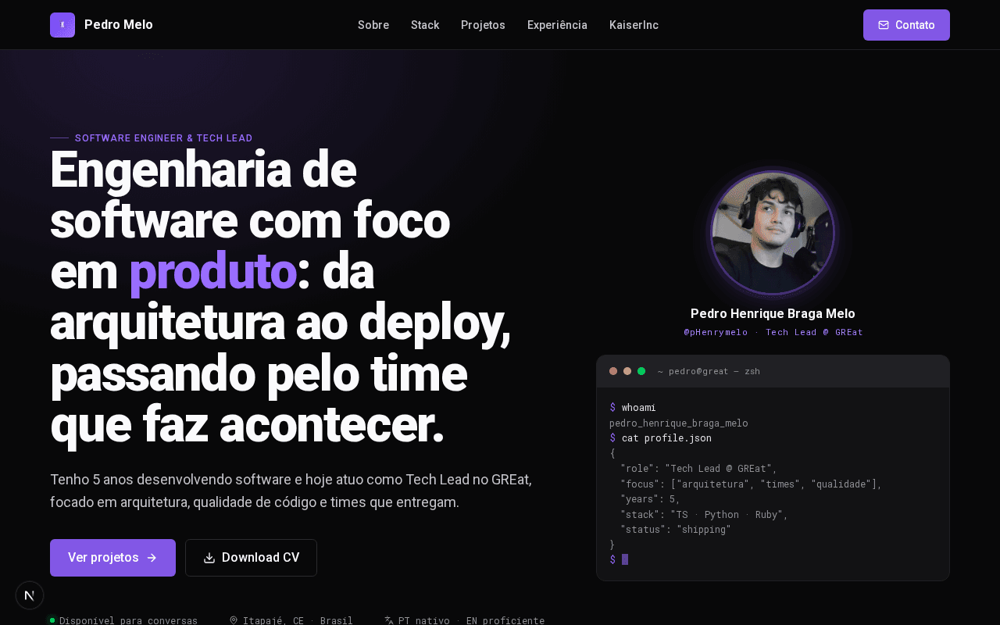
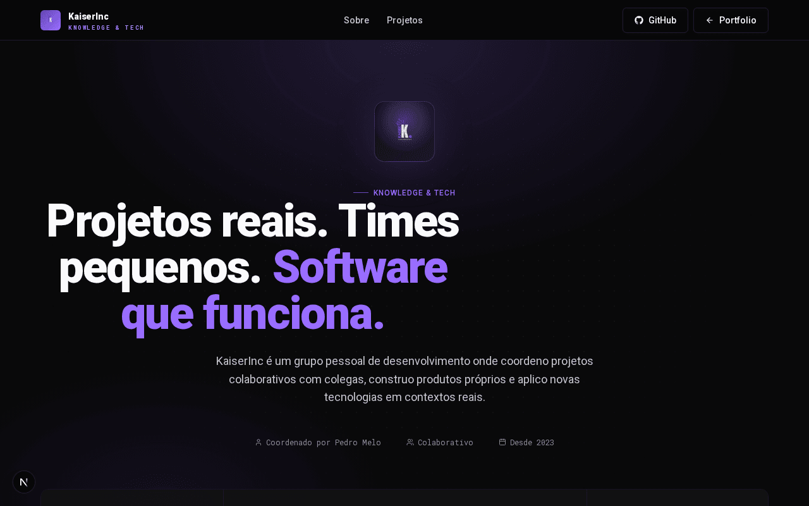

  
  

  <em>Personal portfolio for Pedro Melo (Software Engineer & Tech Lead) and KaiserInc, the personal dev group under which his side projects are built. Live demo coming soon.</em>

---

# Pedro Melo & KaiserInc

Sou Pedro Henrique Braga Melo, engenheiro de software e Tech Lead no GREat, com 5 anos de
experiência entre projetos profissionais, acadêmicos e pessoais.

Meus projetos pessoais e colaborativos nascem sob a KaiserInc, meu grupo de desenvolvimento, onde
coordeno iniciativas com colegas e construo produtos fora do expediente. Não é uma empresa: é uma
estrutura para aprender fundo em cada projeto e manter a qualidade de um produto real na escala que
um time pequeno consegue sustentar.

Os dois portfólios, o meu e o da KaiserInc, compartilham o mesmo design system da KaiserInc: mesma
paleta, tipografia e identidade visual.

## Neste portfólio

- **`/`**: minha trajetória. Tech Lead no GREat, projetos acadêmicos com UFC e Huawei, stack,
  certificações e experiência.
- **`/kaiserinc`**: a KaiserInc. Princípios do grupo e os projetos em andamento, de boilerplates de
  produção a dashboards com dados reais.

**Demo ao vivo:** em breve.

## Contato

- [github.com/pHenrymelo](https://github.com/pHenrymelo)
- [linkedin.com/in/phenrymelo](https://www.linkedin.com/in/phenrymelo)
- pedrohenriquebmelo25@gmail.com
- [github.com/Kaiser-Inc](https://github.com/Kaiser-Inc)
